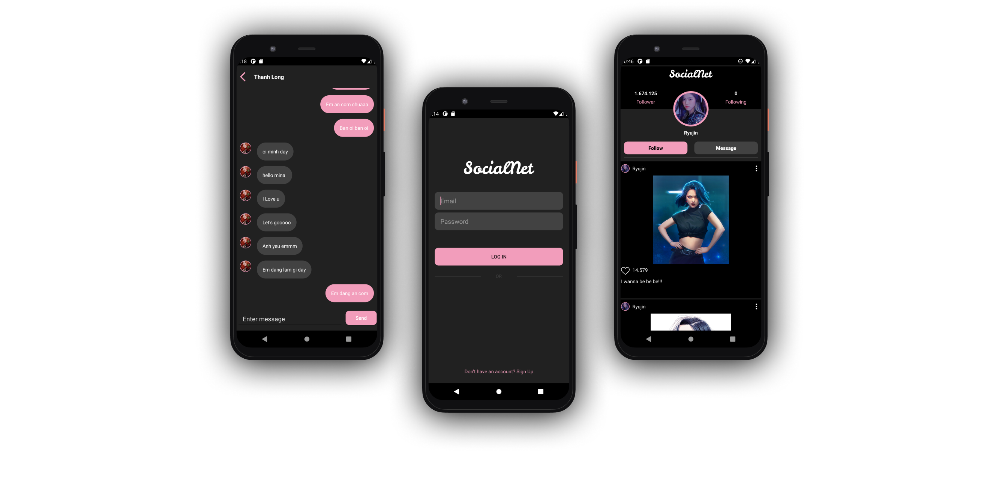
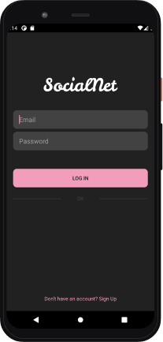
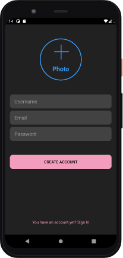
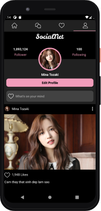

## Technologies 
- Android Studio 4.1.1
- Kotlin 1.3.72
- Firebase 
- [Circle ImageView](https://github.com/hdodenhof/CircleImageView)
- [A powerful image downloading and caching library for Android](https://github.com/square/picasso)
- [A simple, flexible library for complex RecyclerView layouts](https://github.com/lisawray/groupie)

## Screenshots 

  
  
  
   
   
  

