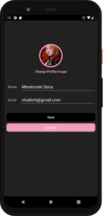
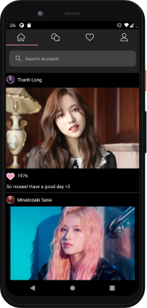
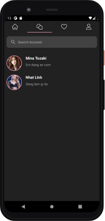
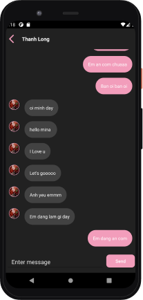

# SocialNet App 

This is a social App using Firebase. Posts can be shared publicly or with pre-approved followers. Users can like photos and follow other users to add their content to a feed. Users can also chat messages in RealTime.

# Content 

1. [Technologies](#technologies)
1. [Video Demo](#demo)
1. [Overview App](#overview)
1. [Screenshots](#screenshots)

# Technologies 
- Android Studio 4.1.1
- Kotlin 1.3.72
- Google Firebase 
- [Circle ImageView](https://github.com/hdodenhof/CircleImageView)
- [A powerful image downloading and caching library for Android](https://github.com/square/picasso)
- [A simple, flexible library for complex RecyclerView layouts](https://github.com/lisawray/groupie)

# Demo 
- [Video Demo](https://drive.google.com/file/d/1t2_Kh_FfoL161quLSgxCvijdg0wMdk-Q/view?usp=sharing)

# Overview 

  

# Screenshots 

### Sign in/up

  
  

### User Profile, Edit Profile 

  
  

### Home Feed

    

### Message Screen, Chat Log

   
  

### Notification 

    

